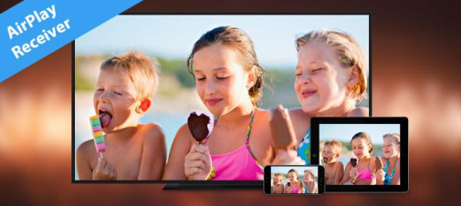

# AirPlay

# Introduction
This is an Android app that can receive and play airplayed screen from iOS or Mac.
I implemented analyzing airplay packets from iOS and Mac and showing them to Android phone or tv.
This app is specially focused on Amazon Fire TV.

